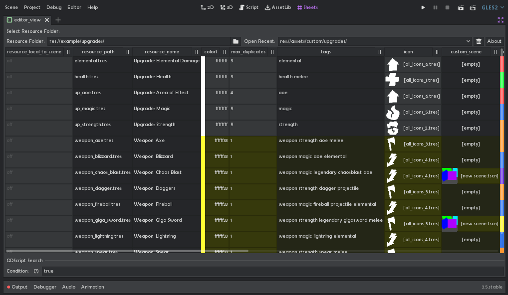
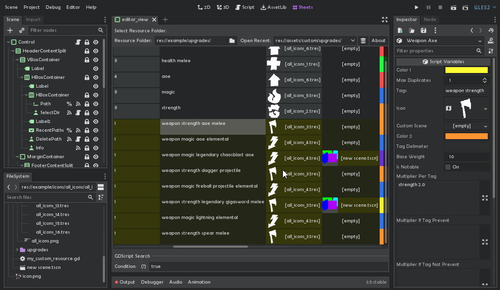

# Edit Resources as Spreadsheet

    "Welp, it is what it sounds like!"

A plugin for Godot 3 (and now 4!) that adds a tab for editing folders of Resources as data tables. It was made from neccessity when trying to develop another plugin.

- Edit Text, Numbers, Colors and Booleans via keyboard, and view Resources, Arrays and Enums editable through Inspector
- Select multiple cells in one column (Shift/Ctrl+Click) to edit them in the Inspector simultaneously.
- Multi-cell text editing (visible cursor not included, unfortunately)
- Copy-paste Text into Cells (one line, one cell)
- Special mass operations for some datatypes
    - Multiply/add numbers
    - Rotate color hues/adjust sat/val/RGB
    - Chop texture into atlas, assign results to each selected resource

- Sort entries by column
- Search by evaluating GDScript expression
- Apply GDScript expression to selected rows
- Row stylization (color-type cells change look of the row until next color-type)
- Saves recently opened folders between sessions
- Full Undo/Redo support.

Possible inputs:
- `Ctrl + Click / Cmd + Click` - Select multiple cells in one column
- `Shift + Click` - Select all cells between A and B in one column
- `Left/Right` - Move cursor along cell text
- `Backspace/Delete` - Erase text Left / Right from cursor
- `Home/End` - Move cursor to start/end of cell
- `Ctrl + <move/erase> / Cmd + <move/erase>` - Move through / Erase whole word
- `Ctrl/Cmd + C/V` - Copy cells / Paste text into cells 
- `Ctrl/Cmd + (Shift) + Z` - The Savior

If clipboard contains as many lines as there are cells selected, each line is pasted into a separate cell.

To add support of more datatypes, check out the `typed_cells` and `typed_editors` folders. `typed_cells` need to be added in the `editor_view` root's exported array, and `typed_editors` are placed there under the `%PropertyEditors` node.

#
Made by Don Tnowe in 2022.

[https://redbladegames.netlify.app]()

[https://twitter.com/don_tnowe]()

Copying and Modiication is allowed in accordance to the MIT license, full text is included.
